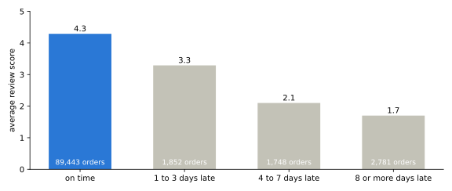
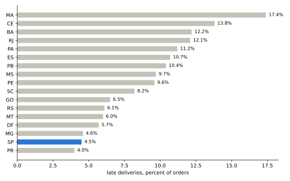

# Late deliveries and bad reviews

An analysis of delivery delays and customer reviews in the Olist Brazilian
marketplace dataset. Late deliveries account for about 7 percent of
delivered orders and 37 percent of one-star reviews.

The data covers about 100,000 orders from 2016 to 2018, including promised
and actual delivery dates and customer reviews. It is available on
[Kaggle](https://www.kaggle.com/datasets/olistbr/brazilian-ecommerce) under
CC BY-NC-SA 4.0. The source data is not included in this repository.

## The question

How do review scores differ between late and on-time deliveries, and how
do delays vary by seller, destination, and month?

## Findings

Of 96,470 delivered orders, 6,534 arrived late, or 6.8 percent. Average
review scores fell as delays increased:

- On time: 4.3 stars.
- One to three days late: 3.3 stars.
- Four to seven days late: 2.1 stars.
- Eight days or more: 1.7 stars, with about seven in ten receiving one star.



Late orders account for 36.7 percent of one-star reviews. This makes
delivery delays worth investigating, although the comparison alone does
not establish what caused each review.

The 20 sellers with the most late orders account for 25 percent of delays.
Their late-delivery rates range from 5 to 10 percent, so the issue is not
concentrated in only those sellers.

Rates also differ by destination. São Paulo has a late-delivery rate of
4.5 percent, compared with 12 percent in Rio de Janeiro and Bahia,
14 percent in Ceará, and 17 percent in Maranhão. Those four higher-rate
states account for 18 percent of orders and 34 percent of delays.



Most months have late-delivery rates of 3 to 6 percent. The rate reaches
12 percent in November 2017, and 14 and 19 percent in February and March 2018.

## Delivery-date scenarios

If every promised date had been three days later, the share classified as
late would fall from 6.8 to 4.8 percent. A seven-day extension would bring
it to 3.0 percent. These scenarios change the delivery promise, not the
actual delivery time.

On-time orders that took at least 22 days still averaged 3.9 stars.
That suggests the promised date is worth examining, but it does not prove
that longer delivery promises would leave sales or customer satisfaction
unchanged.

A useful next step would be to test destination-specific estimates and
additional time allowances in the months with more delays.

## How the numbers were calculated

- Include delivered orders with an actual delivery date: 96,470.
- Define late as arriving after the promised date, in calendar days.
- Keep the newest review when an order has more than one.
- Count an order under each seller when it contains items from multiple sellers.
- Include states with at least 500 orders, months with at least 200, and
  sellers with at least 50.

The calculations are in `analysis.py`, using SQL and Python with DuckDB.

## Run it

```bash
uv venv && uv pip install -e ".[dev]"
# put the Kaggle csv files in data/
python analysis.py
pytest
```

The script prints the result tables and writes charts to `charts/`.
The tests run the analysis queries against a small synthetic dataset.
